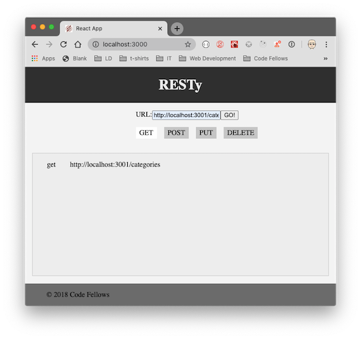

# resty

# LAB - Component Based UI

**RESTy Phase 1:** Begin work on the RESTy API testing application

## Before you begin

Refer to _Getting Started_ in the [lab submission instructions](https://codefellows.github.io/code-401-javascript-guide/reference/submission-instructions/labs/) for complete setup, configuration, deployment, and submission instructions.

Create a UML diagram of the **RESTy** system on a whiteboard before you start

> Create a new repository for this project, called 'resty' and work in a branch called 'base'

## Business Requirements

Refer to the [RESTy System Overview](https://codefellows.github.io/code-401-javascript-guide/curriculum/apps-and-libraries/resty/) for a complete review of the application, including Business and Technical requirements along with the development roadmap.

## Phase 1 Requirements

Today, we begin the first of a 4-Phase build of the RESTy application, written in React. In this first phase, our goal is to setup the basic scaffolding of the application, with intent being to add more functionality to the system as we go. This initial build sets up the file structure so that we can progressively build this application in a scalable manner

## Technical Requirements / Notes

> The application, as written by our development team was done using class components as a proof of concept. In order to go to production, we're going to have to convert this to an application written using React function components so that our foundation is both stable and high performing.

Refactor the RESTy application as follows:

1. Convert all child components of `App.js` from classes to functions

   - The `App` component serves as the container for all sub-components of this application.
   - Leave this component as a Class.
   - Make sure all base styles for `App` are included in a `.scss` imported within `App.js`.
   - Ensure that the `Header`, `Footer`, `Results` and `Form` components are imported using ES6 `import` syntax.

1. Use `.scss` files to style each component

   - Each of the components use their own `.scss` file for styling.

1. Core application functionality should remain unchanged:
   - The `<Form>` component should:
     - Call a function on submit that updates the `<App/>` component via a function sent down as a prop so that the app can process the form values.
   - The `<Results/>` component should show mock API results.

### Assignment Submission Instructions

Refer to the the [Submitting React Apps Lab Submission Instructions](https://codefellows.github.io/code-401-javascript-guide/reference/submission-instructions/labs/react-apps.html) for the complete lab submission process and expectations

> NOTE: For this assignment, **testing is not required**

# [Sandbox Link](https://codesandbox.io/s/purple-monad-jdnzu4)
